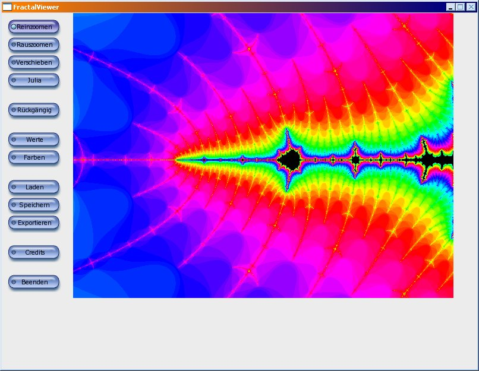

# FractalViewer

FractalViewer allows to explore different fractals. Namely, these are the
Mandelbrot set, the Julia set, the Newton fractal, and the spider fractal. It is
possible to configure the colorization and export images.

For installation instructions see INSTALL.

## Program start under Linux

You shouldn't start the program with Konqueror, because Konqueror
sets the working directory to a wrong directory. Instead start the
console, change to the directory in which you have installed
FractalViewer and type "./fractalviewer" (without quots).

## Usage of the gradient creator

You can change the color of a slider with a right click on it. With
delete-key (not the one above return) you remove the selected slider
(the one with the white border). The cursor should be over the
preview of the gradient when you are pressing delete.
I think there is no need to explain more. The rest works very
similiar to every other GUI.

## Known bugs:

If you change the filter in the open/save file dialog, you won't see
any files anymore until you change the folder. This bug seems to
occur only under Windows XP.

The program does not work under Windows 2000.

